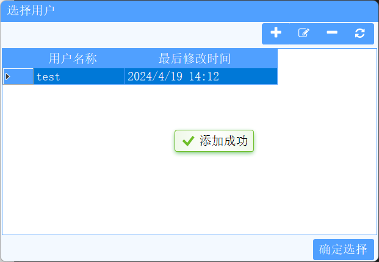
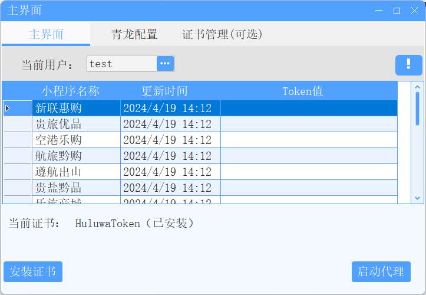
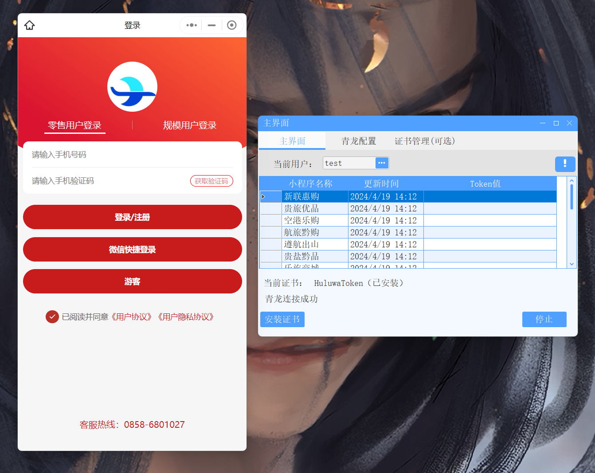
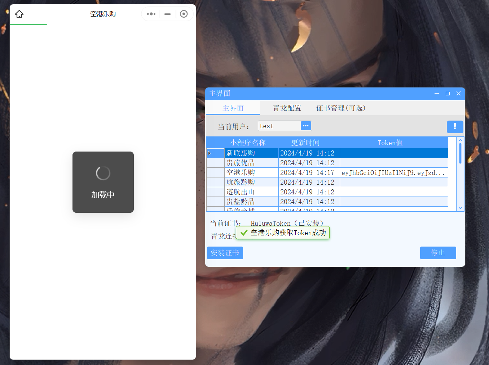

<h1 align="center">
  HuluwaToken
</h1>

使用`SunnyNet`进行抓包，获取登录信息，自动提交到`qinglong`上去，支持多用户管理

## 界面展示
### 选择用户界面

### 主界面

### 配置青龙应用

### 微信快捷登录

### 获取成功

### 免责声明

本项目仅适用于学习和研究，不得用于商业使用

## 链接

- [SunnyUI](https://github.com/yhuse/SunnyUI.git)
- [SunnyNet](https://github.com/qtgolang/SunnyNet.git)
- [qinglong](https://github.com/whyour/qinglong.git)
- [maotai](https://github.com/yize8888/maotai.git)

## 许可协议

[MIT License](LICENSE)